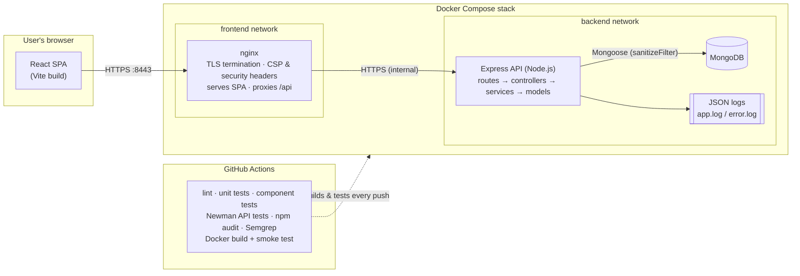
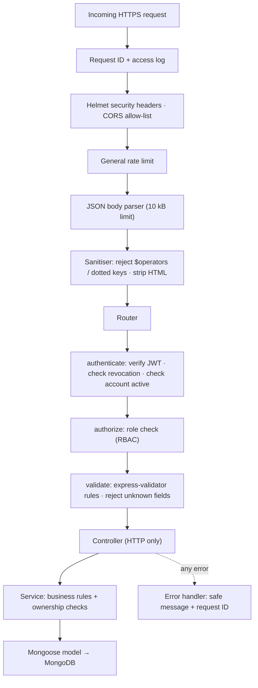

# HustleHub+

**A secure freelance marketplace.** Freelancers advertise services (gigs), clients browse and book them, and administrators manage the platform. Every booking creates a transaction record (payments are simulated), and freelancers get a dashboard that tracks their income and estimates the tax they will owe.

Security was a design requirement from the first commit, not an add-on. This README is the project's complete documentation: architecture, setup, security design, testing, the CI/CD pipeline, logging and the final security review.

> APDS7311 Application Development Security · POE (Parts 1-3)

---

## Contents

1. [Features](#1-features)
2. [Architecture](#2-architecture)
3. [Technology stack](#3-technology-stack)
4. [Repository structure](#4-repository-structure)
5. [Getting started](#5-getting-started)
6. [API reference](#6-api-reference)
7. [Security implementation](#7-security-implementation)
8. [Bookings, transactions and income](#8-bookings-transactions-and-income)
9. [Tax estimation](#9-tax-estimation)
10. [Logging and monitoring](#10-logging-and-monitoring)
11. [Testing](#11-testing)
12. [CI/CD pipeline](#12-cicd-pipeline)
13. [Static code analysis](#13-static-code-analysis)
14. [Containerisation](#14-containerisation)
15. [Final security review](#15-final-security-review)
16. [Project progression](#16-project-progression)
17. [Demo evidence](#17-demo-evidence)

---

## 1. Features

| Role | What they can do |
|---|---|
| **Client** | Register and log in · browse and search gigs · book a gig with a simulated payment · view and cancel their own bookings · view their payment history |
| **Freelancer** | Register and log in · create, edit, hide and delete **their own** gigs · view bookings for their gigs and mark them completed · view transactions · income and tax dashboard with charts |
| **Admin** | View platform statistics · list users · deactivate or reactivate accounts (takes effect immediately) · remove any gig for moderation · view all bookings and transactions |

Admin accounts cannot be created through the public API. They are created with a server-side script (see [5.4](#54-create-an-admin-account)).

---

## 2. Architecture

### 2.1 System overview



**Trust boundaries.** Everything that arrives from the browser is untrusted, so the API validates, sanitises, authenticates and authorises every request before it reaches business logic. MongoDB sits on an internal network that is not published to the host, so only the API can reach it. The API itself is also unpublished in Docker: browsers reach it only through nginx.

### 2.2 Request pipeline inside the API

Each request passes through these layers in order. Anything that fails a check is rejected before the next layer runs.



### 2.3 Backend layers

| Layer | Folder | Responsibility |
|---|---|---|
| Routes | `api/src/routes` | Map URLs to middleware and controllers. They declare *who* may call each endpoint. |
| Middleware | `api/src/middleware` | Cross-cutting security: authentication, RBAC, validation, sanitising, rate limiting, error handling, request logging |
| Validators | `api/src/validators` | Declarative input rules for every endpoint |
| Controllers | `api/src/controllers` | Turn HTTP requests into service calls and service results into HTTP responses. They contain no business logic. |
| Services | `api/src/services` | Business rules: ownership checks, booking/transaction creation, income aggregation, tax calculation |
| Models | `api/src/models` | Mongoose schemas with their own constraints (the last line of validation) |
| Utils | `api/src/utils` | Logger, safe error type, response serialisers (allow-lists of fields), money rounding |

---

## 3. Technology stack

| Area | Choice |
|---|---|
| API | Node.js 24, Express 5, Mongoose 9 (MongoDB) |
| Auth | bcryptjs (cost 12), jsonwebtoken (HS256) |
| Security middleware | helmet, cors, express-rate-limit, express-validator, xss |
| Logging | winston (structured JSON) |
| Frontend | React 19, React Router, Recharts, Vite |
| Testing | Jest + Supertest + mongodb-memory-server (API) · Vitest + Testing Library (client) · Postman + Newman (endpoints) |
| Quality & security | ESLint + eslint-plugin-security · Semgrep · npm audit |
| Delivery | Docker, Docker Compose, nginx (unprivileged) · GitHub Actions |

---

## 4. Repository structure

```
.
├── api/                         Express API
│   ├── src/
│   │   ├── app.js               Express app and middleware order
│   │   ├── server.js            HTTPS server, database connection, graceful shutdown
│   │   ├── config/              env validation, database, SARS tax tables
│   │   ├── constants/           roles, categories, statuses
│   │   ├── controllers/         HTTP layer
│   │   ├── middleware/          authenticate, authorize, validate, sanitize, rate limits, errors
│   │   ├── models/              User, Gig, Booking, Transaction, RevokedToken
│   │   ├── routes/              one file per resource
│   │   ├── services/            business logic and ownership checks
│   │   ├── utils/               logger, AppError, serializers, money
│   │   └── validators/          express-validator rules
│   ├── scripts/                 createAdmin, test server, Docker healthcheck
│   ├── tests/                   unit + integration tests
│   ├── Dockerfile
│   └── .env.example
├── client/                      React frontend
│   ├── src/
│   │   ├── api/                 fetch wrapper and endpoint functions
│   │   ├── components/          layout, forms, charts, shared UI
│   │   ├── context/             authentication state
│   │   ├── pages/               one component per screen
│   │   ├── utils/               formatting and client-side validation
│   │   └── test/                Vitest component tests
│   ├── nginx.conf               production web server config (HTTPS, CSP)
│   └── Dockerfile
├── Postman/                     collection + environment (run with Newman)
├── docs/screenshots/            evidence screenshots
├── .github/workflows/ci.yml     CI/CD pipeline
├── docker-compose.yml
└── .env.example                 variables for Docker Compose
```

---

## 5. Getting started

### 5.1 Prerequisites

- Node.js 22 or later (developed on Node 24) and npm
- OpenSSL, which ships with Git for Windows (Git Bash)
- A MongoDB database: a MongoDB Atlas cluster, local MongoDB, or the Docker stack
- Docker Desktop, if you want to run the containerised stack

### 5.2 HTTPS: generate the local certificate

The API and the frontend both use HTTPS. Generate one self-signed certificate for `localhost` from the repository root:

```bash
mkdir -p api/certs
openssl req -x509 -newkey rsa:2048 -nodes -sha256 -days 365 \
  -keyout api/certs/localhost-key.pem -out api/certs/localhost-cert.pem \
  -subj "/CN=localhost" -addext "subjectAltName=DNS:localhost,IP:127.0.0.1"
```

The `certs/` folder and every `*.pem` file are git-ignored, so private keys are never committed. Browsers and Postman will warn that the certificate is self-signed. That is expected for local development: accept it once in the browser, and turn off *SSL certificate verification* in Postman settings.

### 5.3 Run the API

```bash
cd api
npm install
cp .env.example .env          # then set MONGO_URI and JWT_SECRET
npm run dev                   # https://localhost:4000
```

Generate a strong `JWT_SECRET` with:

```bash
node -e "console.log(require('crypto').randomBytes(48).toString('hex'))"
```

The server refuses to start if `MONGO_URI` is missing, if `JWT_SECRET` is shorter than 32 characters, or if `JWT_SECRET` still holds the placeholder value.

**No database?** `npm run start:test-server` starts the real API over HTTPS with a throwaway in-memory MongoDB and a seeded admin (`admin@hustlehub.test` / `Admin@Passw0rd!`). Use it for demos and the Postman collection.

### 5.4 Create an admin account

Set `ADMIN_EMAIL` and `ADMIN_PASSWORD` (at least 12 characters) in `api/.env`, then run:

```bash
npm run create-admin
```

### 5.5 Run the frontend

```bash
cd client
npm install
npm run dev                   # https://localhost:5173
```

The Vite dev server reuses `api/certs` for HTTPS and forwards `/api` requests to `https://localhost:4000`, so the browser only ever talks to one origin.

### 5.6 Run everything with Docker

```bash
cp .env.example .env          # set JWT_SECRET
docker compose up --build
```

Then open **https://localhost:8443**. To create an admin inside the stack, set `ADMIN_PASSWORD` in `.env` and run:

```bash
docker compose exec api node scripts/createAdmin.js
```

To run the Postman suite against the containers, restart the API with a higher login limit (the suite logs in more than 10 times), point Newman at nginx, then restore the limit:

```bash
RATE_LIMIT_AUTH=200 docker compose up -d --wait api
cd api && npx newman run ../Postman/HustleHub.postman_collection.json \
  -e ../Postman/HustleHub.local.postman_environment.json --insecure \
  --env-var baseUrl=https://localhost:8443 \
  --env-var adminEmail=admin@hustlehub.local --env-var adminPassword=<ADMIN_PASSWORD from .env>
cd .. && docker compose up -d --wait api        # back to the production limit of 10
```

Useful commands: `docker compose ps` (health status), `docker compose logs -f api`, `docker compose exec api cat /app/logs/app.log` (structured logs), and `docker compose down` (stop; add `-v` to also delete the database volume).

### 5.7 Environment variables (API)

| Variable | Default | Purpose |
|---|---|---|
| `PORT` | `4000` | API port |
| `USE_HTTPS` | `true` | Serve over HTTPS using `certs/` |
| `MONGO_URI` | - | MongoDB connection string (**required**) |
| `JWT_SECRET` | - | Token signing key, 32+ characters (**required**) |
| `JWT_EXPIRES_IN` | `1h` | Token lifetime |
| `CLIENT_ORIGIN` | `https://localhost:5173` | CORS allow-list (comma-separated) |
| `TRUST_PROXY` | `0` | Number of trusted proxies (1 behind nginx) |
| `BCRYPT_ROUNDS` | `12` | bcrypt cost factor |
| `LOCKOUT_MAX_ATTEMPTS` / `LOCKOUT_DURATION_MINUTES` | `5` / `15` | Account lockout policy |
| `RATE_LIMIT_AUTH` / `RATE_LIMIT_BOOKING` / `RATE_LIMIT_GENERAL` | `10` / `20` / `300` | Requests per 15-minute window |
| `PLATFORM_FEE_RATE` | `0.1` | Share of each booking kept by the platform |
| `LOG_LEVEL` | `info` | winston log level |

---

## 6. API reference

Base URL: `https://localhost:4000/api`. Every route except register, login and `/health` requires `Authorization: Bearer <token>`.

| Method | Path | Roles | Description |
|---|---|---|---|
| GET | `/health` | public | Health check |
| POST | `/auth/register` | public | Register as client or freelancer (rate limited) |
| POST | `/auth/login` | public | Log in and receive a JWT (rate limited, account lockout) |
| POST | `/auth/logout` | any | Revoke the current token |
| GET | `/auth/me` | any | Current user's profile |
| GET | `/gigs` | any | Browse active gigs (`search`, `category`, `minPrice`, `maxPrice`, `page`, `limit`) |
| GET | `/gigs/mine` | freelancer | Own gigs, including hidden ones |
| GET | `/gigs/:id` | any | Gig details (hidden gigs: owner/admin only) |
| POST | `/gigs` | freelancer | Create a gig |
| PATCH | `/gigs/:id` | freelancer (**owner**) | Update own gig |
| DELETE | `/gigs/:id` | freelancer (**owner**), admin | Delete a gig |
| POST | `/bookings` | client | Book a gig: simulated payment, creates a transaction (rate limited) |
| GET | `/bookings` | any | Bookings the user takes part in (admin: all) |
| GET | `/bookings/:id` | participant, admin | Booking details |
| PATCH | `/bookings/:id/complete` | freelancer (**assigned**) | Mark completed |
| PATCH | `/bookings/:id/cancel` | client (**owner**) | Cancel and issue a simulated refund |
| GET | `/transactions` | any | Transactions the user takes part in (admin: all) |
| GET | `/finance/summary` | freelancer | Income for the tax year, monthly breakdown and tax estimate (`ageGroup`, `deductions`) |
| GET | `/admin/users` | admin | List users (`role`, `page`, `limit`) |
| PATCH | `/admin/users/:id/status` | admin | Activate or deactivate an account |
| GET | `/admin/stats` | admin | Platform statistics |

Errors always have the same shape and never contain internal details:

```json
{ "error": "Validation failed", "details": [{ "field": "price", "message": "Price must be between R50 and R1,000,000" }], "requestId": "9f0c…" }
```

---

## 7. Security implementation

### 7.1 Password hashing

- Passwords are hashed with **bcrypt at cost factor 12** before storage (`authService.register`). The plain-text password is never stored or logged. It exists only in memory for the duration of the request.
- bcrypt adds a unique **salt** to every hash, so identical passwords produce different hashes and precomputed rainbow tables are useless.
- bcrypt is **deliberately slow**. At cost 12 each guess takes hundreds of milliseconds, which makes offline brute force of a stolen database impractical.
- The `passwordHash` field is `select: false` in the schema, so it is excluded from every query unless explicitly requested. Responses are built from **allow-lists** (`utils/serializers.js`), so a hash can never leak through an API response.
- Password policy: 8+ characters with upper case, lower case, a digit and a symbol. Passwords over **72 bytes** are rejected, because bcrypt silently ignores anything past that length.

### 7.2 Token-based authentication (JWT)

- A successful login returns a **JWT signed with HS256** and a secret of 32+ characters. The token carries only the user ID (`sub`), the role, a unique token ID (`jti`), the issuer, the audience and an expiry (1 hour by default). It contains no personal data.
- The `authenticate` middleware runs on **every protected request**. It:
  1. requires the `Bearer` scheme;
  2. verifies the signature, expiry, **issuer, audience and algorithm**. Pinning `algorithms: ['HS256']` blocks `alg: none` and algorithm-confusion attacks;
  3. checks the token ID against the **revocation list**, which is filled when a user logs out;
  4. re-loads the user and refuses the token if the **account no longer exists or has been deactivated**.
- The role used for authorisation is read from the database, not from the token. A role change or deactivation takes effect on the next request.
- In the browser the token lives in `sessionStorage` (cleared when the tab closes), and the strict Content Security Policy blocks the injected scripts that could otherwise read it.

### 7.3 Input validation

Every endpoint has an **express-validator** rule set (`api/src/validators`):

- Types, lengths, formats, ranges and enumerations are checked for every field. Examples: price R50 to R1,000,000 with at most two decimals, a valid category, `isMongoId()` for every ID.
- **Unknown fields are rejected** (`checkExact`). This blocks *mass assignment*: a user cannot send `"role": "admin"`, `"isActive": false` or `"freelancer": "<someone else>"`.
- Controllers only receive the **validated, sanitised values** (`matchedData`), never the raw request body.
- Mongoose schemas enforce the same constraints again as a second line of defence.
- The React client mirrors the rules for instant feedback. The server never relies on client-side validation.

### 7.4 Why HTTPS matters

Without TLS, anyone on the same network (public Wi-Fi, a compromised router, an ISP) can read and alter traffic. That would expose passwords at login, the JWT on every request (enough to impersonate the user), and personal financial data. HTTPS provides:

- **Confidentiality:** credentials, tokens and income data are encrypted in transit.
- **Integrity:** responses cannot be tampered with, for example by injecting scripts into the page.
- **Authentication of the server:** the client knows it is talking to the real API.

This project serves the API over **HTTPS only** (TLS 1.2+). Plain HTTP connections are refused. The frontend is served over HTTPS by both Vite and nginx, and nginx redirects port 8080 to HTTPS. The internal nginx → API hop is also encrypted. **HSTS** (`Strict-Transport-Security`) tells browsers never to downgrade to HTTP. In production the self-signed certificate would be replaced by one from a trusted CA, such as Let's Encrypt.

### 7.5 Authorisation: role checks and ownership checks

- **RBAC:** `authorize(...roles)` limits each route to the roles that may use it. Only freelancers create gigs, only clients book, and only admins reach `/admin`.
- **Ownership:** a role check alone is not enough, because every freelancer has the same role. The service layer therefore checks that the record belongs to the caller (`services/accessControl.js`):
  - a freelancer can update or delete **only their own gigs**;
  - only the **assigned freelancer** can complete a booking, and only the **booking's client** can cancel it;
  - bookings and transactions are **scoped by query** to the caller, so they never load other users' records;
  - hidden gigs are visible only to their owner and admins.
- Booking prices are always taken from the database. A client-supplied `price` is rejected.

### 7.6 Injection and XSS protection

| Threat | Controls |
|---|---|
| **NoSQL injection** | Bodies containing `$` operator keys or dotted paths are rejected with 400 and logged (`middleware/sanitize.js`). Mongoose `sanitizeFilter` wraps any user-derived filter in `$eq`. Express's *simple* query parser never builds nested objects from `?a[$ne]=`. Validators enforce primitive types. |
| **Regex injection / ReDoS** | Search text is escaped before it is used in a regular expression. |
| **Stored XSS** | HTML tags are stripped from every string field before storage (`xss` library, empty allow-list). React escapes all rendered text, and ESLint rules forbid `dangerouslySetInnerHTML` and `innerHTML`. |
| **Reflected / DOM XSS** | A strict CSP from nginx (`script-src 'self'`) blocks inline and third-party scripts. The API's CSP is `default-src 'none'`. |

### 7.7 Rate limiting

| Limiter | Scope | Default |
|---|---|---|
| General | every request, per IP | 300 / 15 min |
| Authentication | `/auth/register`, `/auth/login`, per IP | 10 / 15 min |
| Booking | `POST /bookings`, **per user** | 20 / 15 min |

Exceeding a limit returns `429` with standard `RateLimit` headers, and the event is logged. Behind nginx, `TRUST_PROXY=1` makes the limiter use the real client IP, and only one proxy hop is trusted, so clients cannot spoof `X-Forwarded-For`.

### 7.8 Security headers

- **API (Helmet):** CSP `default-src 'none'; frame-ancestors 'none'`, HSTS (1 year), `X-Content-Type-Options: nosniff`, `X-Frame-Options`, `Referrer-Policy: no-referrer`, `Cross-Origin-Resource-Policy: same-origin`, `X-Powered-By` removed, and `Cache-Control: no-store` on all API responses.
- **Web app (nginx):** CSP `default-src 'self'; script-src 'self'; style-src 'self'; object-src 'none'; frame-ancestors 'none'; …`, HSTS, `X-Frame-Options: DENY`, `Permissions-Policy` (camera, microphone, geolocation and payment disabled), and `server_tokens off`.
- **CORS** allows only the configured frontend origin(s), specific methods and specific headers.

### 7.9 Secure error handling and configuration

- A central error handler returns **safe, generic messages**. Stack traces, file paths, database errors and configuration values are never sent to the client, only a `requestId` that links the response to the full server-side log entry.
- Malformed JSON, oversized bodies (10 kB limit) and invalid IDs are handled explicitly.
- Configuration is validated at start-up, and the server fails fast on missing or placeholder secrets. `.env`, certificates and keys are git-ignored, and `.env.example` documents every variable without real values.

### 7.10 Additional security features (beyond the brief)

| Feature | What it does | Where |
|---|---|---|
| **1. Account lockout** | After 5 failed logins the account is locked for 15 minutes (HTTP 423), even when the correct password is then supplied. This stops slow, distributed password guessing that stays under per-IP rate limits. The event is logged. | `services/authService.js` |
| **2. Server-side token revocation** | Logging out stores the token's `jti` in a revocation collection with a MongoDB TTL index, so a stolen token copy stops working at logout instead of at expiry. | `services/tokenService.js`, `models/RevokedToken.js` |
| **3. Instant account deactivation** | Admins can deactivate an account. Because every request re-checks the user, the user's existing tokens are refused on the next call. | `middleware/authenticate.js`, `services/adminService.js` |
| **4. Timing-safe login** | When the email does not exist, bcrypt still compares against a dummy hash, so response time does not reveal which emails are registered. Wrong email and wrong password give the same message. | `services/authService.js` |
| **5. Mass-assignment protection** | Any request field without a validation rule is rejected. | `middleware/validate.js` |
| **6. Request correlation IDs** | Every response carries `X-Request-Id`, which also appears in logs and error messages, so incidents can be traced without exposing internals. | `middleware/requestContext.js` |
| **7. Hardened containers** | Non-root users in both images, a read-only API filesystem, `no-new-privileges`, and a database that isn't reachable from the host. | Dockerfiles, `docker-compose.yml` |

---

## 8. Bookings, transactions and income

1. A client opens a gig and confirms the **simulated payment**. No card data is collected and no gateway is contacted.
2. The API re-reads the gig (it must exist and be active), then creates:
   - a **Booking** (`confirmed`) linked to the client, the freelancer and the gig, with the title and price copied so history survives later edits or deletion; and
   - a **Transaction** with a unique reference (`TXN-…`), the amount, the **10% platform fee**, the **freelancer earnings** (amount minus fee), the currency (ZAR), `paymentMethod: "simulated"` and `status: "paid"`.

   If the transaction cannot be written, the booking is rolled back, so no booking is left without a transaction.
3. The freelancer marks the booking **completed**. Alternatively the client **cancels** it, which marks the transaction **refunded**.
4. Freelancer **income** is the sum of `freelancerEarnings` on `paid` transactions. Refunded transactions are excluded. Status changes use conditional updates, so two simultaneous requests can't both complete or cancel the same booking.

---

## 9. Tax estimation

The dashboard estimates South African **personal income tax** on the freelancer's HustleHub+ earnings. The logic is in `api/src/services/taxService.js` (pure functions, fully unit-tested), and the tables are in `api/src/config/taxTables.js`.

**Inputs**
- **Income:** the freelancer's earnings (after platform fees) from paid transactions in the current **tax year**, which runs from 1 March to the end of February.
- **Deductions** (optional): deductible business expenses the freelancer enters.
- **Age group:** under 65, 65-74 or 75+ (this determines the rebates).

**Calculation**
1. `taxable income = max(0, earnings − deductions)`
2. Find the SARS bracket for the taxable income.
3. `tax before rebates = bracket base amount + (taxable income − bracket threshold) × marginal rate`
4. Subtract the rebates: primary R17,235, plus secondary R9,444 at 65+, plus tertiary R3,145 at 75+.
5. `estimated tax = max(0, result)`. The effective rate is `tax ÷ taxable income`.

**Tables used:** SARS individual rates for the 2026 year of assessment:

| Taxable income (R) | Tax |
|---|---|
| 0 - 237,100 | 18% of taxable income |
| 237,101 - 370,500 | 42,678 + 26% above 237,100 |
| 370,501 - 512,800 | 77,362 + 31% above 370,500 |
| 512,801 - 673,000 | 121,475 + 36% above 512,800 |
| 673,001 - 857,900 | 179,147 + 39% above 673,000 |
| 857,901 - 1,817,000 | 251,258 + 41% above 857,900 |
| 1,817,001 and above | 644,489 + 45% above 1,817,000 |

**Worked example.** R400,000 taxable income, under 65: 77,362 + (400,000 − 370,500) × 31% = R86,507, minus the primary rebate of R17,235, gives **R69,272** (effective rate 17.3%).

**What the dashboard shows**
- **Estimated tax so far:** the calculation above applied to year-to-date earnings.
- **Projected tax for the year:** earnings are annualised (`earnings ÷ months elapsed × 12`) and taxed the same way. This matters because a freelancer's bracket depends on the full year's income.
- **Suggested monthly set-aside:** projected tax ÷ 12. Freelancers are normally *provisional taxpayers* who pay in August and February, so this helps them budget.
- Summary cards, a monthly earnings bar chart (with a table view), and a breakdown of gross income into take-home pay, estimated tax and platform fees.

**Limitations (shown to the user):** this is an estimate based on platform earnings only. It ignores other income, medical tax credits and provisional tax already paid. The tables must be updated after each national budget.

---

## 10. Logging and monitoring

The API writes **structured JSON logs** with winston to the console, `logs/app.log` and `logs/error.log`. Files rotate at 5 MB and five files are kept. Every entry has a timestamp, level, `event` name, `requestId`, and the user ID and IP where relevant.

| Category | Events |
|---|---|
| Authentication | `auth.register.success`, `auth.register.duplicate`, `auth.login.success`, `auth.login.failure` (with reason), `auth.login.blocked`, `auth.lockout`, `auth.logout`, `auth.token.rejected` (missing / malformed / invalid / revoked / inactive user) |
| Access control | `access.denied` (role check or ownership check, with path and roles) |
| Attacks and abuse | `security.injection_blocked`, `security.rate_limited` |
| Business | `gig.created/updated/deleted`, `booking.created/completed/cancelled`, `transaction.created/refunded`, `admin.user.deactivated/reactivated` |
| Errors and operations | `error.unhandled` (full stack trace, **server-side only**), `http.request` (method, path, status, duration), `server.started`, `db.connected` |

**What is never logged:** passwords, password hashes, tokens and `Authorization` headers. A redaction formatter replaces those keys with `[REDACTED]` as a safety net. Request bodies and query strings are not logged.

**Why this matters.** Logs are the evidence trail for security monitoring:
- **Detection:** a spike in `auth.login.failure` or `auth.lockout` points to credential stuffing. `security.injection_blocked` and repeated `access.denied` show someone probing the API.
- **Investigation:** the `requestId` a user sees in an error links directly to the server-side entry with the full stack trace.
- **Accountability:** bookings, transactions and admin actions leave an audit trail of who did what and when.
- **Operations:** request durations and 5xx errors show performance and reliability problems.

The JSON format can be shipped straight to a log platform (ELK, Grafana Loki, Datadog) for dashboards and alerts.

Sample entries (from the Newman run):

```json
{"event":"auth.login.failure","reason":"bad_password","level":"warn","message":"Login failed: wrong password","requestId":"cef16775-…","userId":"6abab8ace6a685af106ba0c2","ip":"::1","timestamp":"2026-09-28T18:57:51.691Z"}
{"event":"security.injection_blocked","key":"$ne","level":"warn","message":"Blocked request containing a MongoDB operator","path":"/api/auth/login","requestId":"5d31e75a-…","timestamp":"2026-09-28T18:57:51.787Z"}
{"event":"access.denied","requiredRoles":["freelancer"],"role":"client","level":"warn","message":"Access denied by role check","requestId":"86e37311-…","timestamp":"2026-09-28T18:57:52.463Z"}
{"event":"booking.created","bookingId":"6abab8b1e6a685af106ba0c6","gigId":"6abab8b0e6a685af106ba0c4","level":"info","message":"Booking created with simulated payment","timestamp":"2026-09-28T18:57:53.…"}
```

---

## 11. Testing

| Suite | Tool | What it covers | Result |
|---|---|---|---|
| API unit tests | Jest | Tax calculation and tax-year logic, sanitiser (NoSQL/XSS), ownership rules | 26 tests |
| API integration tests | Jest + Supertest + in-memory MongoDB | Registration, login, lockout, token revocation, security headers, gig CRUD with role and ownership checks, bookings and transactions, refunds, finance summary, admin deactivation, rate limiting | 60 tests |
| Frontend tests | Vitest + Testing Library | Rendering and interaction: login/register validation and flows, error handling that hides internals, route guards, gig form, XSS-safe rendering, booking confirmation, dashboard cards/table/recalculation, API client | 28 tests |
| API endpoint tests | Postman + Newman | 59 requests / 210 assertions over HTTPS: every endpoint, valid and invalid scenarios, role and ownership checks, injection, XSS, error handling, revocation | 0 failures |

Run them:

```bash
# API unit + integration tests (with coverage)
cd api && npm test            # or: npm run test:coverage

# Frontend tests
cd client && npm test

# Postman collection with Newman (two terminals)
cd api && npm run start:test-server
cd api && npm run test:api    # HTML report: Postman/reports/newman-report.html
```

The collection can also be imported into Postman: `Postman/HustleHub.postman_collection.json` and `Postman/HustleHub.local.postman_environment.json`. Run the folders in order, because they share variables.

---

## 12. CI/CD pipeline

`.github/workflows/ci.yml` runs on every push to `main`/`redesign` and on every pull request to `main`. **Any failing test, lint rule, security scan or container check fails the pipeline.**

| Job | Steps |
|---|---|
| **api** | `npm ci` → ESLint with the security plugin (`--max-warnings 0`) → Jest unit and integration tests with coverage → upload coverage |
| **client** | `npm ci` → ESLint (`--max-warnings 0`) → Vitest component tests with coverage → `vite build` → upload the build |
| **api-endpoints** | generate a TLS certificate → start the API over HTTPS with an in-memory database → run the Postman collection with **Newman** → upload the HTML report and logs |
| **security** | `npm audit --audit-level=high` for the API and the client → **Semgrep** static analysis (`--error`) → upload results |
| **containers** | runs after all the jobs above pass → `docker compose up --build --wait` → smoke tests through nginx (SPA served, `/health` OK, a protected route returns 401, HTTP redirects to HTTPS, CSP header present) → upload container logs → tear down |

---

## 13. Static code analysis

Three complementary tools run in the pipeline:

1. **Semgrep** with the `p/javascript`, `p/nodejs`, `p/react`, `p/secrets` and `p/owasp-top-ten` rule packs (144 rules), covering API code, client code, the nginx config, Dockerfiles and the Compose file.
2. **ESLint + eslint-plugin-security** on both apps, with zero warnings allowed. It checks for object injection, unsafe regular expressions, non-literal file paths, timing attacks and `eval`. Custom rules ban `dangerouslySetInnerHTML` and `innerHTML`.
3. **npm audit** for known-vulnerable dependencies, failing on high or critical.

**Results and what they indicate**

| Tool | First run | Action | Current |
|---|---|---|---|
| Semgrep | 3 findings: (1) the Docker healthcheck disabled TLS verification (`rejectUnauthorized: false`); (2 and 3) nginx used the client-controlled `$host` header in the HTTP → HTTPS redirect (open-redirect / host-header injection) and in the proxied `Host` header | All fixed: the healthcheck now trusts the local certificate explicitly, and nginx uses a fixed host name | **0 findings** |
| ESLint security | 6 warnings: one unsafe-regex (price decimals), one unused disable directive, four false positives (file paths from server config, a log-redaction key loop) | The regex was replaced with arithmetic and the directive removed. False positives are suppressed line by line, each with a written justification | **0 warnings** |
| npm audit | 1 moderate advisory in `qs` (a transitive Express dependency: denial of service) | Updated with `npm audit fix` | **0 vulnerabilities** |

These results show that the code follows the common secure-coding rules for Node and React. The findings that did exist were in infrastructure configuration rather than in application logic, which is why the Dockerfiles, nginx and Compose files are scanned too.

---

## 14. Containerisation

| File | Details |
|---|---|
| `api/Dockerfile` | `node:24-alpine`, production dependencies only (`npm ci --omit=dev`), runs as the non-root `node` user, `HEALTHCHECK` that verifies TLS |
| `client/Dockerfile` | Multi-stage: builds with Node, then serves static files from `nginx-unprivileged` (non-root) with the hardened `nginx.conf` |
| `docker-compose.yml` | `mongo` (named volume, healthcheck, backend network only) · `api` (read-only filesystem, `no-new-privileges`, certificates mounted read-only, logs volume, not published) · `client` (published on 8443/8080) |

Start order is enforced with healthchecks: MongoDB healthy → API healthy → client. The pipeline's **containers** job builds and smoke-tests the stack on every run.

---

## 15. Final security review

### Injection

- **NoSQL injection** is blocked at four layers: operator keys are rejected at the edge, validators enforce primitive types, the simple query parser prevents nested query objects, and Mongoose `sanitizeFilter` wraps user-derived filters in `$eq`. Operator filters built in server code are explicitly marked `mongoose.trusted()`. Tests prove that `{"email": {"$ne": null}}` and `?category[$ne]=` are rejected.
- **Regex / ReDoS:** search input is escaped, and ESLint flags unsafe patterns.
- No SQL, shell commands or `eval` are used anywhere.

### Cross-site scripting (XSS)

- **Stored XSS:** HTML is stripped from all text before storage, which tests verify with `<script>` and `` payloads.
- **Rendering:** React escapes all output, raw-HTML APIs are banned by lint rules, and a frontend test confirms that HTML in a gig title renders as text.
- **Defence in depth:** the nginx CSP (`script-src 'self'`) blocks inline and injected scripts even if a bug let one through. The API's own CSP is `default-src 'none'`.

### Authentication weaknesses

| Weakness | Mitigation |
|---|---|
| Stolen password database | bcrypt cost 12 with per-user salt, and the hash is never returned |
| Brute force / credential stuffing | Per-IP rate limit + per-account lockout + strong password policy |
| User enumeration | Same message for an unknown email and a wrong password, with timing equalised using a dummy hash |
| Token forgery or tampering | HS256 with a 32+ character secret, algorithm pinned, issuer and audience checked |
| Stolen or long-lived tokens | 1-hour expiry, revocation on logout, re-check of account status on every request, HTTPS + HSTS in transit |
| Weak configuration | Start-up validation rejects missing or placeholder secrets |

**Known limitations and next steps:** there are no refresh tokens (users log in again after an hour); the token is in `sessionStorage` rather than an `httpOnly` cookie, a trade-off mitigated by the strict CSP; there is no multi-factor authentication; rate-limit counters are in memory, so a multi-instance deployment would need a shared store such as Redis; and the self-signed certificate must be replaced with a CA-issued one in production.

### Access control

- Every route declares its roles, and the `authorize` middleware enforces them (deny by default).
- **Ownership checks** in the service layer stop users of the same role from touching each other's records: gigs, booking completion and booking cancellation.
- List endpoints are **scoped by query**, so other users' records are never even loaded.
- Admin creation is not exposed publicly, admins cannot deactivate themselves, and deactivation takes effect immediately.
- Mass assignment is blocked because unknown fields are rejected, and prices are never trusted from the client.
- The frontend route guards exist only for navigation: the API enforces every rule independently. Integration and Newman tests cover the 403 cases for role checks and ownership checks.

---

## 16. Project progression

| Part | Delivered |
|---|---|
| **Part 1: Secure foundations** | Express API with registration and login, bcrypt hashing, JWT-protected routes, HTTPS with a local certificate, input validation, controlled errors, Helmet, CORS, Postman collection. Evidence: `docs/screenshots/part1/` |
| **Part 2: Secure stack** | MongoDB with Mongoose · layered routes → controllers → services → models · RBAC plus ownership checks · gig CRUD · bookings with simulated payments and transaction records · income tracking · NoSQL and XSS sanitisation · rate limiting · Helmet CSP · React frontend · Newman and frontend tests |
| **Part 3: DevSecOps and finalisation** | Tax estimation and financial dashboard with charts · structured security logging · GitHub Actions pipeline (tests, builds, Newman, npm audit, Semgrep, Docker smoke test) · Dockerfiles for the API and client + Docker Compose · additional security features (lockout, token revocation, instant deactivation and more) · final security review |

---

## 17. Demo evidence

### Screenshots

| Screen | File |
|---|---|
| Login | `docs/screenshots/01-login.png` |
| Registration with live password rules | `docs/screenshots/03-register.png` |
| Client: browse gigs | `docs/screenshots/04-client-browse.png` |
| Client: simulated payment confirmation | `docs/screenshots/05-booking-confirm.png` |
| Client: bookings | `docs/screenshots/07-client-bookings.png` |
| Freelancer: income and tax dashboard | `docs/screenshots/08-freelancer-dashboard.png` |
| Freelancer: gig form validation | `docs/screenshots/09-my-gigs-form-validation.png` |
| Freelancer: transactions | `docs/screenshots/10-freelancer-transactions.png` |
| Admin: statistics and user management | `docs/screenshots/11-admin.png` |
| Mobile, dark mode dashboard | `docs/screenshots/12-mobile-dark-dashboard.png` |
| Part 1 evidence (HTTPS, headers, Postman) | `docs/screenshots/part1/` |


### Pipeline, static analysis and logs

- **CI runs:** see the repository's *Actions* tab. Each run publishes the Newman HTML report, Semgrep results, coverage and container logs as artifacts.
- **Logging evidence:** see the sample entries in [section 10](#10-logging-and-monitoring) and the `newman-report` artifact, which includes the API log from the test run.

### Demo video

- Part 1: _add link_
- Part 2: _add link_
- Part 3 (final): _add link_
